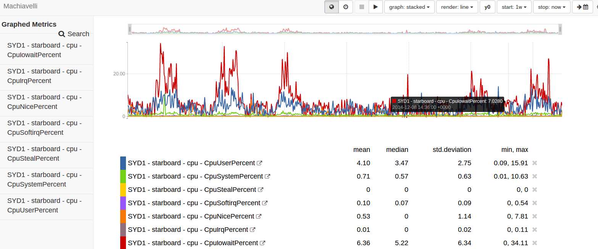
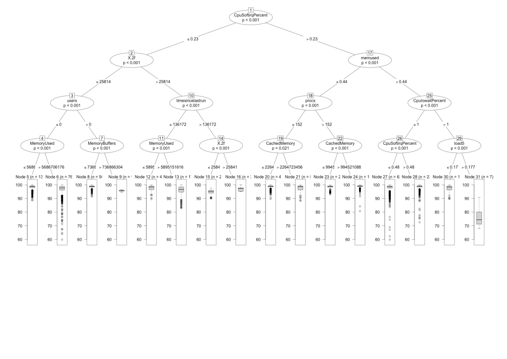
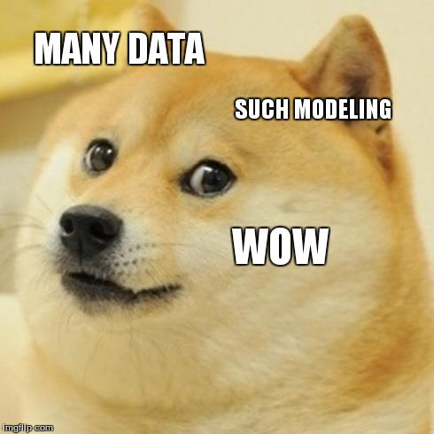

# Core problems

 1. Know what's broken;
 1. Know what's breaking;
 1. Know what's about to break.

(While minimising the number of sysadmins you wake up at 0300.)

# Traditional methods

 - fixed-size interpolating datastores
 - lose precision over time
 - good for humans looking at graphs
 - machines aren't that good at pattern recognition

# Traditional methods



# Wait a minute, these problems remind me of something...

 - time series forecasting
 - anomaly detection (classification)

# But first things first


# Vaultaire query DSL

```haskell
-- | Query all metrics for a host
  where query =
          [ (host, metric, uom, ts, payload)
          | origin      <- foreachQ [read "R82KX1"]
          , request     <- foreachQ $ [buildRequestFromPairs [(T.pack
"hostname", T.pack host)]]
          , (addr, sd)  <- addressesWith origin request
          , (SimplePoint _ ts payload) <- metrics origin addr start end
          , host        <- if (fuzzy sd ("host", ""))
                           then lookupQ "host" sd
                           else lookupQ "hostname" sd
          , metric      <- lookupQ "metric" sd
          , uom         <- lookupQ "uom" sd
          ]
```

# Early attempts at improvement



# Future


