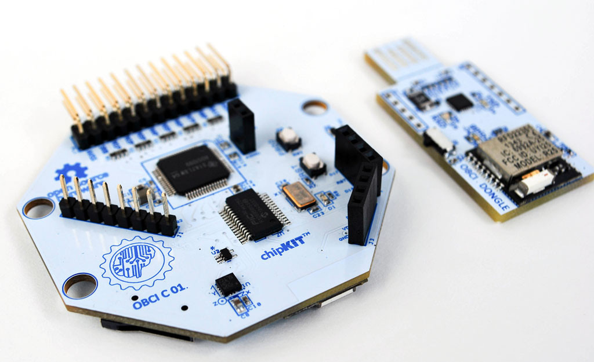
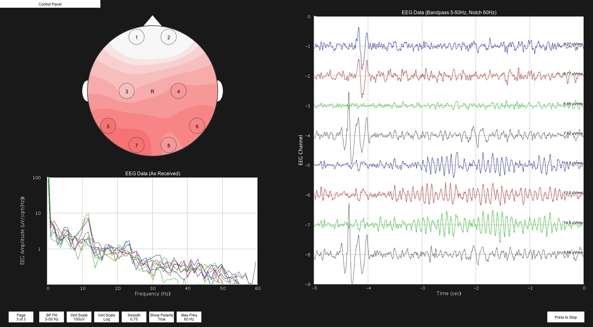
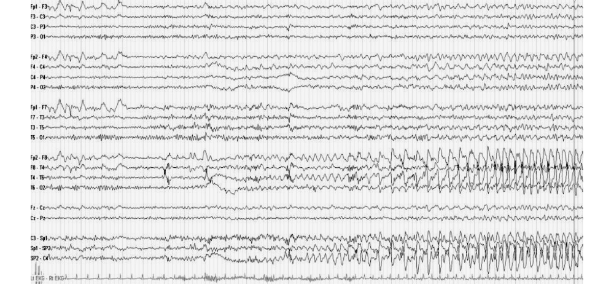

# DIY electrophysiography

(The safest thing you can do involving connecting your cranium to an
electronic device you built in your garage.)

# Flavours

 - Electrocardiography (ECG) - heart.
 - Electroencephalography (EEG) - brain.
 - Electromyography (EMG) - muscle.
 - Electrocorticography (ECoG) - cortical surface (don't try this one at home).

# Practical applications and other applications

## Practical

 - Sleep tracking.
 - Brain-computer interfaces.
 - Biofeedback.
 - Cardiac abnormality identification.
 - Seizure detection.

. . .

## Questionably-practical

 - Binaural beats.
 - Game design.

. . .

## Awesome

 - Object recognition with evoked-response potentials.
 - Controlling your powered exoskeleton.

# Design

 - Electrodes (wet/dry, active/passive).
 - Instrumentation amplifier.
 - Bandpass filter (for EEG, high-pass at ~1Hz, low-pass at ~40Hz).
 - Notch filters at 50Hz (for Australian AC).
 - Driven right-leg circuit.
 - ADC.

# Proprietary consumer hardware

 - NeuroSky.
 - Emotiv (EPOC, Insight).
 - BCInet (formerly Neural Impulse Actuator).
 - Star Wars Force Trainer.

# Open hardware designs

## OpenBCI EEG board

# Open hardware designs

## Olimex ECG Arduino shield

# Analysis: know your squiggly lines

# Analysis: Fourier transform

 - Breaks a signal into its components (sinusoids).
 - Allows identification of EEG bands ("brainwaves").

## EEG bands

Frequency (Hz) Band   Significance
-------------- -----  ------------------------------------
0-4            delta  slow-wave sleep (stage-3 NREM)
7.5-12.5       alpha  thalamic pacemaker, associated 
                      with relaxed states
12.5-30        beta   reduced in sleep and coma, 
                      signifies normal wakefulness
25-100         gamma  hippies talking about consciousness

# Analysis: wavelet decomposition

 - Breaks a signal into individual 'spikes' over time.
 - Allows identification of common features, and provides a basis for
   isolating uncommon features.

. . .

## Uncommon features: seizure onset

# Analysis - software

## Toolkits

 - EEGLAB - `http://sccn.ucsd.edu/eeglab/`.
 - OpenVIBE - `http://openvibe.inria.fr`.
 - SciPy - `http://www.scipy.org/`.

## Training datasets

 - PhysioBank - `http://physionet.org/physiobank/`.

# Fin.

 - OpenBCI: `https://github.com/openbci`
 - OpenVIBE: `http://openvibe.inria.fr`
 - Arduino ECG: `https://github.com/fractalcat/arduecg`

## Slides

`https://tesser.org/doc/slides/`

## Contact

Sharif Olorin `(sio@tesser.org)` - contrary to rumor, neither citizen
nor scientist.
