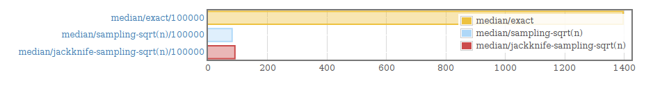
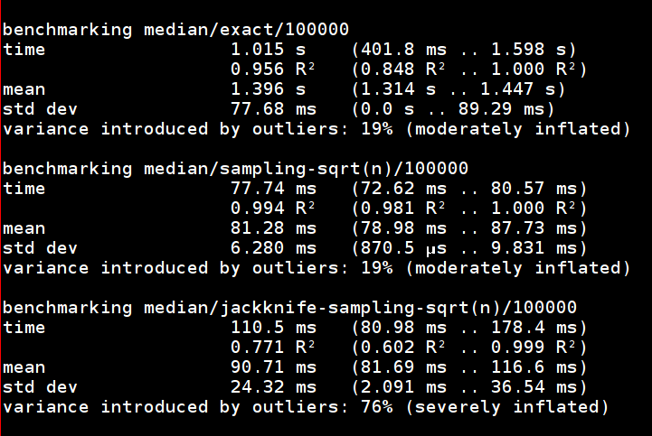

# Online approximation of quantiles: a case study in Haskell

## Criteria

 - Memory - $O(n^k) : n < 1$ (but preferably constant).
 - Time - $O(n^k) : n < 2$ (but preferably linear).
 - Accuracy - as good as we can get given the above.

## Reference implementation

```haskell
quickselect k (x:xs) 
  | k < l     = quickselect k ys
  | k > l     = quickselect (k-l-1) zs
  | otherwise = x
  where (ys, zs) = partition (< x) xs
        l = length ys
```

## Types

```haskell
data Quantile = Quantile Int Int
  deriving (Eq, Show)

quantile :: Int -> Int -> Quantile
quantile k q
  | q > k     = Quantile k q
  | otherwise = error "quantile not defined where k >= q"

qidx :: Quantile -> Int -> Int
qidx (Quantile k q) n =
  let i = (fromIntegral (n * k)) / (fromIntegral q)
  in floor i
```

## Types

```haskell
newtype Stream m = Stream (Producer Double m ())
```

```haskell
newtype Selector m =
  Selector
    { unSelector ::
     (   Quantile
      -> Stream m
      -> m Double
     )
    }
```

# Baseline: exact, slow and stupid

## Baseline

 - $O(n  \log_2  n)$ time.
 - $O(1)$ space.

### Algorithm

 - Sort $P$ using a disk-optimised external merge sort.
 - Select $P_{qidx(k, q, |P|)}$.

## Baseline: code

```haskell
external' q src = do
  (fp, fh) <- liftIO $ 
    openTempFile tmpDir "quantile"
  n <- countOut fh src
  fp' <- liftIO $ do
    hClose fh
    externalMergeSort fp
  fh' <- openFile fp' ReadMode
  quant <- select (qidx q n) $
                 P.fromHandle fh' 
             >-> P.map read
  removeFile fp >> removeFile fp'
  pure quant
```

# Sampling

## Systematic random sampling

 - Textbook definition: pick a starting index uniformly at
   random. Treating the input stream as a circular buffer, select every
   $k$th element. 
 - Code monkey's definition: pick a starting index uniformly from
   $[0, \frac{n}{k})$, select every $k$th element.
 - Easy to implement, but entirely useless if there's any periodicity in the data.

## Bernoulli sampling

 - Iterate over the input stream, selecting every element with probability $\frac{1}{n/k} = \frac{k}{n}$.
 - Works well on periodic and nonperiodic data.
 - It's tempting to exit early after $k$ or $k + \epsilon$ elements to avoid running out of memory every so often; usually a bad idea.
 - Alternatively: when the subsample is too large, throw it out and try again. Try and avoid this happening too often.

## Sampling: probably good enough

 - $O(n)$ time.
 - $O(f(n))$ space.
 - $f(n) = \sqrt{n}$ seems to work pretty well in practice.

### Algorithm

 - Set $n = |\hat{P}|$.
 - Set $k = f(n)$.
 - Iterate over $P$; insert into a rank/select structure $R$ with
   probability $\frac{n}{k}^{-1}$.
 - Take $R_{qidx(k, q, |R|)}$.

### Estimating $|P|$

 - Precomputation is quite costly if streaming from disk.
 - In practice, dividing the file size by a constant works pretty well.

## Sampling: code

```haskell
sampling' k n q (Stream s) = withSystemRandom $ \gen -> do
  P.foldM (sample gen) (pure []) select s
  where  choose g = choose' <$> uniformR (0.0, invP) g
        
         choose' x
          | x < 1.0   = True
          | otherwise = False

         invP = (fromIntegral n) / (fromIntegral k)

         sample g (vs,c) v = choose g >>= \case
           True -> let vs' = insertBag v vs in
                   pure (vs', c+1)
           False -> pure (vs,c)

         select (vs, c) = pure $ vs !! (qidx q c)
```

## Improvements: jackknifed sampling

$Q_{jackknife}(X_i) = Q(X_{j \neq i}^{|X|})$

```haskell
import Statistics.Resampling

jackknifeQ vs =
  pure . quickselect median $
    jackknife (quickselect q) $ V.fromList vs
```

## Greenwald-Khanna online quantiles

@greenwald2001space

 - Estimates quantiles to within $\epsilon |X|$.
 - Space complexity of $O(\frac{1}{\epsilon}\log{\epsilon |X|})$.
 - Maintains an ordered list of tuples $(v, r_{min}, r_{max})$ such
   that $r_{min} <= rank(v) <= r_{max}$.
 - When the list is approaching its maximum size, merge the tuples
   which match the fewest observations.

# Benchmarks

## Results - performance



## Results - performance



## Results - accuracy

### Gaussian - $n = 10^6$ $\mu = 9000$ $\sigma = 1000$

| estimator      | MSE    | stddev |
|----------------+--------+--------|
| exact          | 0.0    | 0.0    |
| sampling/sqrt  | 1656.9 | 1309.2 |
| jackknife/sqrt | 1181.1 | 1144.4 |

### Gamma - $n = 10^6$ $\alpha = 100$ $\beta = 50$

| estimator      | MSE    | stddev |
|----------------+--------+--------|
| exact          | 0.0    | 0.0    |
| sampling/sqrt  | 330.8  | 356.4  |
| jackknife/sqrt | 475.1  | 620.8  |

## [work in progress]

`https://tesser.org/doc/slides`

`https://github.com/olorin/approx-quantiles`

### Other approaches

 - CKMS biased quantiles. @Cormode2005
 - Shrivastava-Buragohain-Agrawal-Suri sensor aggregation. @Shrivastava2004

## References


