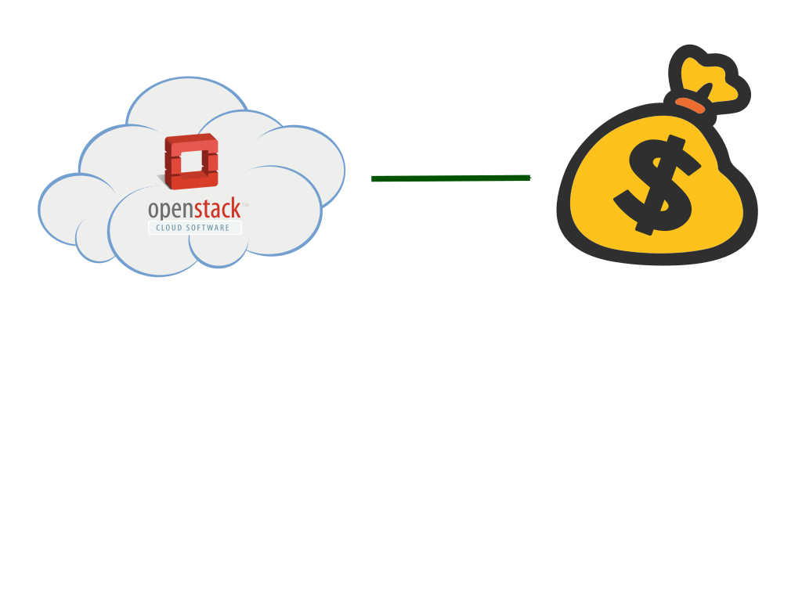
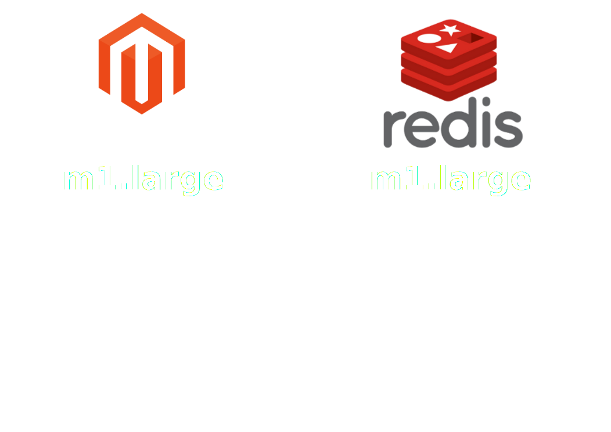
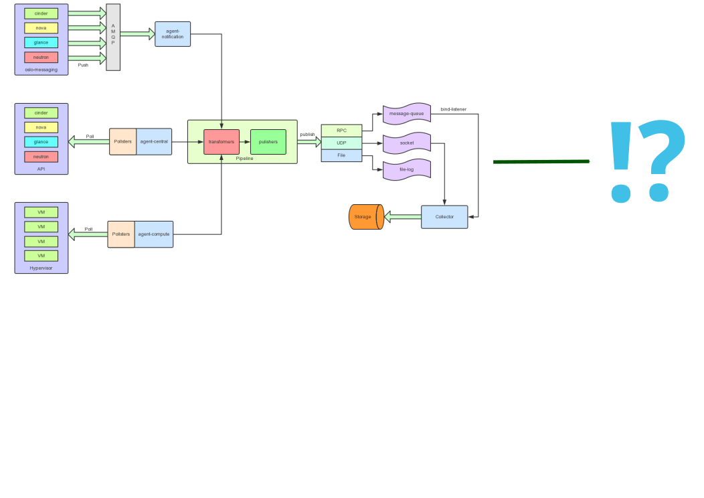
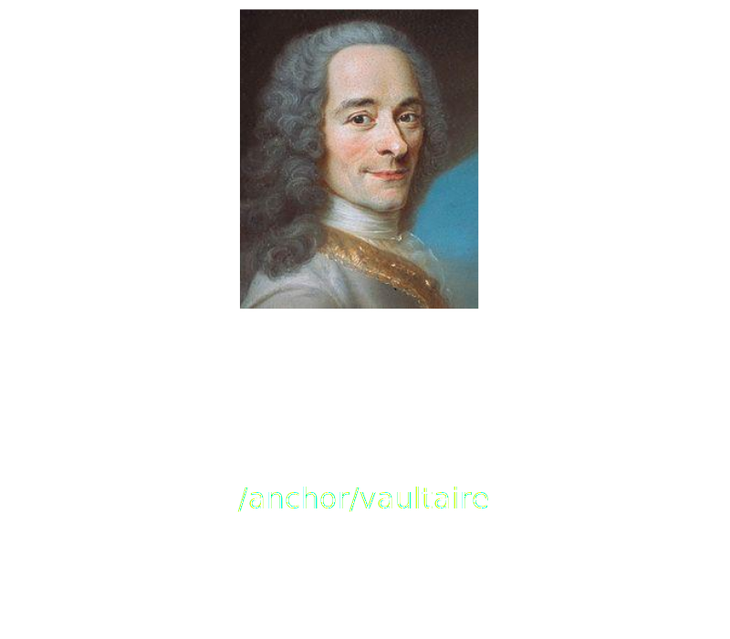
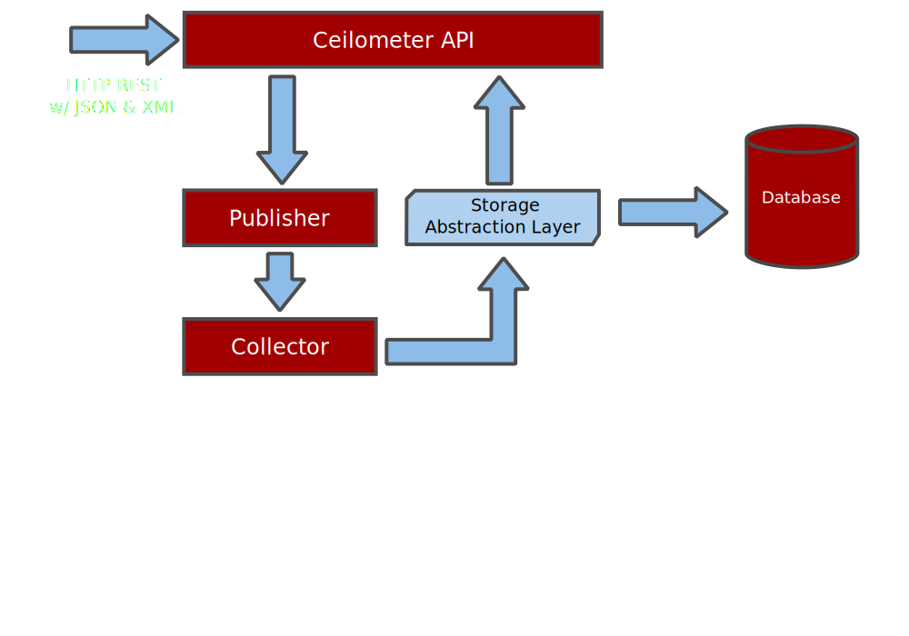
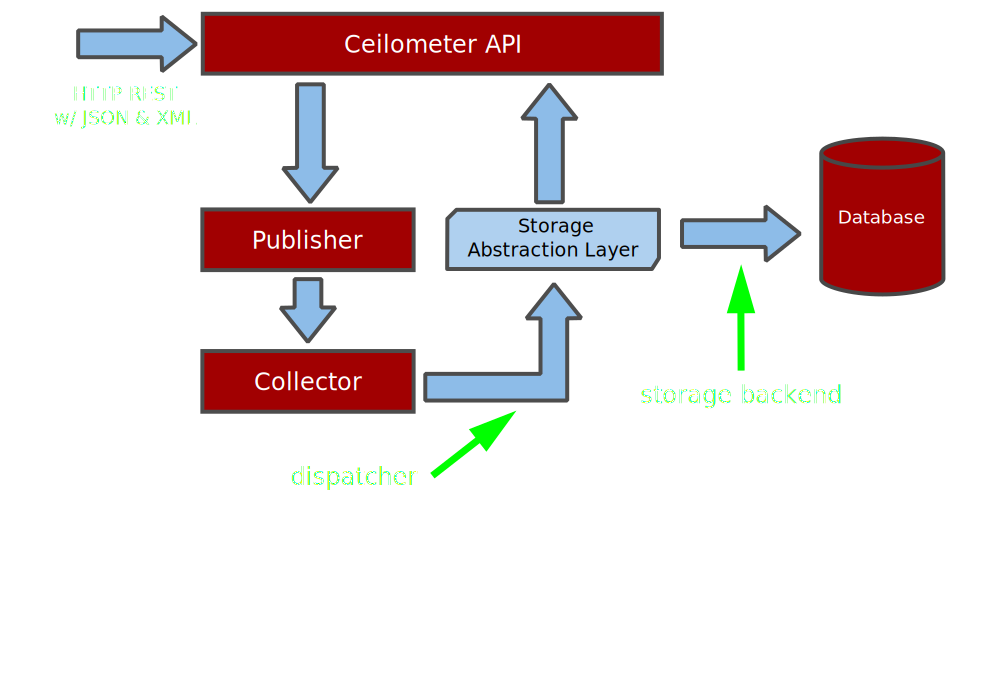
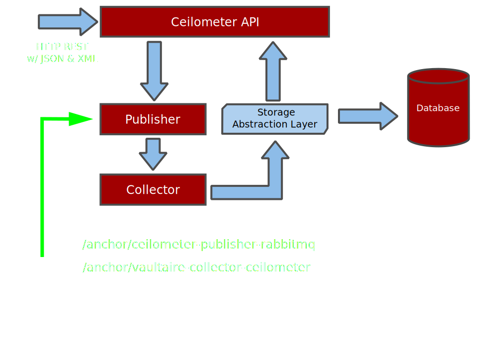
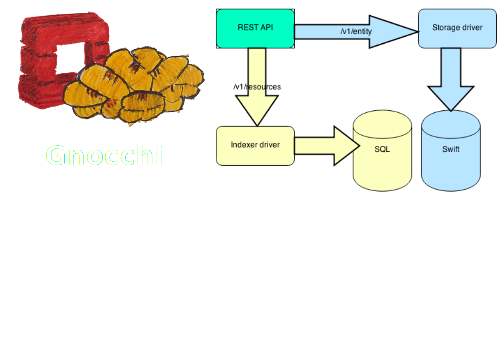

# Theory



# Utility billing?

----------   ---  ---  ----   -----------   ---------------
 r3.xlarge    4    13  30.5   1 x 80 SSD    $0.350 per Hour  
r3.2xlarge    8    26    61   1 x 160 SSD   $0.700 per Hour  
r3.4xlarge   16    52   122   1 x 320 SSD   $1.400 per Hour  
r3.8xlarge   32   104   244   2 x 320 SSD   $2.800 per Hour  
----------   ---  ---  ----   -----------   ---------------

# Disparities and arbitrage



# Aligning incentives

Disproportionate resource usage should lead to disproportionate cost. 

 - If it can be contended, track it.
 - CPU time and disk IOPS are the resources affecting QoS for your
   customers.
 - Store forever (disks are cheap, and capacity planning requires
   historical data).
 - Granular from the start - customers like to know what they're paying
   for.

# Granularity with Borel

```json
[
    {
        "customer-id": "21891",
        "quantity": 1500663808,
        "resource": "diskio-writes",
        "resource_id": "284a9f20-4d5e-4044-a955-f2fb9e00e66d",
        "uom": "B"
    },
    {
        "customer-id": "21891",
        "quantity": 137476,
        "resource": "neutron-data-rx",
        "resource_id": "instance-00001050-284a9f20-4d5e-4044-a955-f2fb9e00e66d-tapd46c8be5-ac",
        "uom": "B"
    },
    {
        "customer-id": "21891",
        "quantity": 516570000000,
        "resource": "cpu-usage",
        "resource_id": "284a9f20-4d5e-4044-a955-f2fb9e00e66d",
        "uom": "cpu-ns"
    },
    {
        "customer-id": "21891",
        "quantity": 9942017556480000,
        "resource": "memory-allocation",
        "resource_id": "284a9f20-4d5e-4044-a955-f2fb9e00e66d",
        "uom": "MB-ns"
    }
]
```


# Practice



# Fun with schemaless message formats

<!---
These suck because

 - there's no guarantee you'll get the data you're expecting
 - especially when the docs are incomplete
 - and doubly so when the docs which are present are sometimes wrong
-->

```json
{
    "id": "68d4a944-7222-11e4-b78a-525400f01ec9",
    "name": "image.size",
    "project_id": "229301dc166a4b5bbf234564c01aaaed",
    "resource_id": "87252d51-d050-4a16-a7f0-bbed90f8e9aa",
    "resource_metadata": {
        "checksum": null,
        "container_format": null,
        "created_at": "2014-09-18T05:54:57",
        "deleted": false,
        "deleted_at": null,
        "disk_format": null,
        "is_public": false,
        "min_disk": 0,
        "min_ram": 0,
        "name": "openstack-client-vm",
        "properties": {
            "bdm_v2": "True",
            "block_device_mapping": "[{\"guest_format\": null, \"boot_index\": 0, \"no_device\": null, [ ... ]",
            "checksum": "91f209e3423e45bdad3bc7f65b8eb0b8",
            "container_format": "bare",
            "description": "Official image from Canonical",
            "disk_format": "raw",
            "image_id": "c5f42541-0008-48aa-82a7-25dfc185b88b",
            "image_name": "Official-ubuntu-trusty",
            "min_disk": "0",
            "min_ram": "0",
            "root_device_name": "/dev/vda",
            "size": "2361393152"
        },
        "protected": false,
        "size": 0,
        "status": "active",
        "updated_at": "2014-09-18T05:54:57"
    },
    "source": "openstack",
    "timestamp": "2014-11-22T08:34:44Z",
    "type": "gauge",
    "unit": "B",
    "user_id": null,
    "volume": 0
}
```

# Problems
## or, "Why can't I just use an RDBMS?"

 - That message on the last slide? 1.3kB.
 - A few hundred of those per second.
 - Millions of messages per hour, hundreds of gigabytes per month.
 - Sure, you can write that to a MySQL cluster.
 - But I wouldn't want to be your operations team.

<!---
 - Can't throw away data for audit reasons.
-->

# But, but, NoSQL!


<!---
 - Inconsistent metering data leads to angry customers.
-->

# Enter Vaultaire



# Tapping Ceilometer

<!---
 > - Export from MySQL, Mongo et al.
 > - Custom storage backend.
 > - Custom dispatcher.
 > - Custom publisher.
-->



# Hardpoints



# Publisher



# Events are awesome

 - Space-efficient.
 - Very cheap to query.
 - As of Juno, the only way to measure volumes and snapshots.

# ...most of the time

 - Messages get lost.
 - Like the ```volume.delete``` your customer triggered on that 1TB
   SSD eight months ago.
 - The best kinds of customers are the ones without pitchforks.

<!---
# Guidelines for pitchfork avoidance

 - Rely on pollsters wherever you can.
-->

# Future



# Acknowledgements

 - Barney, Katie, Oswyn and Tran for doing all the actual work;
 - aphyr ([http://aphyr.com](http://aphyr.com)), for evaluating MongoDB
   via image macros so we don't have to;
 - and assorted dead French intellectuals for their invaluable assistance in
   one of computer science's two hardest problems (unfortunately not
   cache invalidation or off-by-one errors).
